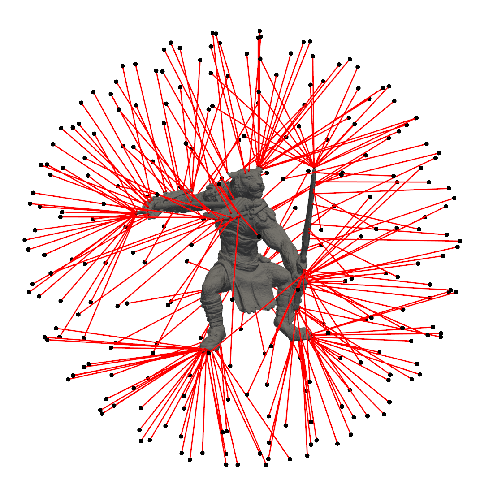

# BVH-Tree

> Bonding Volume Hierarchy Tree for 3D surface meshes written in Python.

`BVH-Tree` is Python + Numba implementation of static bounding volume hierarchy tree for fast distance queries on 3D surface meshes.


## Features

- Lightweight and easy to understand bvhtree class writen in pure Python.
- JIT-compiled functions with multiprocessing support via [Numba](https://numba.readthedocs.io/en/stable/).
- Interactive visualization via [PyVista](https://docs.pyvista.org/).


## Project structure

- [´bvhtree´](src/bvhtree) - Main module for BVH-Tree.
- [´examples´](examples) - Scripts which serve as examples on how to use `BVH-Tree`.


## Installation from source

The `BVH-Tree` is tested and works on Windows 11 and Linux Debian 12. It should also work on any MacOS systems.
The project can be simply installed trough `pip`. It is recommended to install the project in
a separated [virtual environment](https://docs.python.org/3/library/venv.html) via `venv` module.

1. Clone the repository to a folder.
```sh
git https://github.com/MarkoLeskovar/BVH-Tree
```

2. Navigate to the folder.
```sh
 cd BVH-Tree
```

3. Create a virtual environment with a name ".venv".
```sh
python3 -m venv .venv
```

4. **Linux** - activate virtual environment.
```sh
source .venv/bin/activate
```

4. **Windows** - activate virtual environment.
```sh
source .venv/Scripts/activate
```

5. For local development install `BVH-Tree` in editable mode.
```sh
pip install -e .
```


## Closest point example

```python
import numpy as np
import pyvista as pv
from bvhtree import AABBTree
import bvhtree.mesh.examples as examples

# Load an example mesh
mesh_size = 50
mesh = examples.action_figure(size=mesh_size)

# Create points on a sphere
points = examples.sphere(diameter=2 * mesh_size, nu=5).vertices

# Create the tree
aabb_tree = AABBTree.from_surface_mesh(mesh, depth_lim=16, split_lim=10)

# Query closest points
distances, _, closest_points = aabb_tree.query_closest_points(points, workers=16)

# Add mesh and points
pl = pv.Plotter()
pl.add_mesh(mesh.to_pyvista_grid(), color='gray', opacity=1.0)
pl.add_points(points, render_points_as_spheres=True, point_size=10, color='black')

# Create lines
lines = np.full(shape=(points.shape[0], 3), fill_value=2, dtype='int')
lines[:, 1] = np.arange(points.shape[0])
lines[:, 2] = np.arange(points.shape[0], 2 * points.shape[0])

# Add the closest points
pl.add_points(closest_points, render_points_as_spheres=True, point_size=5, color='red')
pl.add_mesh(pv.PolyData(np.vstack((points, closest_points)), lines=lines), color='red', line_width=3)

# Show everything
pl.show()
```


